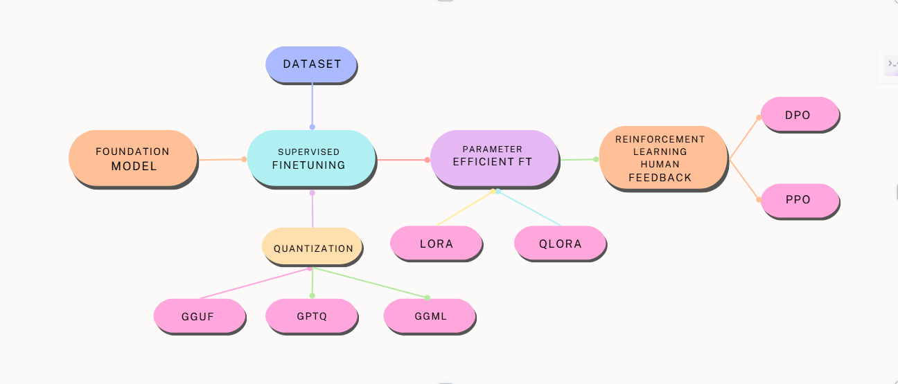

# 🎯 Fine-Tuning Language Models

> **A comprehensive, beginner-friendly repository for fine-tuning large language models using modern techniques like LoRA, DPO, and Unsloth optimizations.**



[](https://opensource.org/licenses/MIT)
[](https://www.python.org/downloads/)
[](https://colab.research.google.com/)

## 🚀 Quick Start (5 Minutes)

```python
# Install dependencies
!pip install "unsloth[colab-new] @ git+https://github.com/unslothai/unsloth.git"

# Load and fine-tune in 3 lines
from unsloth import FastLanguageModel
model, tokenizer = FastLanguageModel.from_pretrained("unsloth/llama-3-8b-bnb-4bit")
model = FastLanguageModel.get_peft_model(model, r=16)

# Add your training code here
```

## 🧭 Navigation Guide

| 📁 Folder | 🎯 Purpose | 👥 Best For | ⏱️ Time Needed |
|-----------|------------|--------------|----------------|
| **[FineTuning LanguageModels](./FineTuning%20LanguageModels/)** | Basic concepts & simple examples | Beginners, students | 1-2 hours |
| **[FineTuning LargeLanguageModels](./FineTuning%20LargeLanguageModels/)** | Advanced techniques & model-specific guides | Practitioners, researchers | 3-5 hours |  
| **[FineTuning VisionModel](./FineTuning%20VisionModel/)** | Vision-language model fine-tuning | Computer vision researchers | 2-3 hours |
| **[RLHF Optimization](./RLHF%20Optimization/)** | Human preference alignment (DPO, RLHF) | Advanced users, alignment researchers | 2-4 hours |
| **[docs/](./docs/)** | Comprehensive guides & troubleshooting | All skill levels | Reference |

## 🤔 Which Technique Should I Use?

### **🔰 I'm New to Fine-Tuning**
→ Start with **[Basic LoRA Fine-tuning](./FineTuning%20LanguageModels/README.md)**
- ✅ Easy to understand
- ✅ Low memory requirements  
- ✅ Good results for most tasks

### **💻 I Have Limited GPU Memory**
→ Use **[4-bit Quantized LoRA](./docs/memory-benchmarks.md)**
- ✅ Works on Google Colab T4
- ✅ 70% less memory usage
- ✅ Minimal performance loss

### **🎯 I Want Better Instruction Following**
→ Try **[DPO Training](./RLHF%20Optimization/README.md)**
- ✅ Improves response quality
- ✅ Better human alignment
- ✅ No reward model needed

### **🖼️ I Need Vision-Language Models**  
→ Use **[Vision Model Fine-tuning](./FineTuning%20VisionModel/README.md)**
- ✅ Image + text processing
- ✅ Mathematical formula recognition
- ✅ Multimodal AI applications

## 📊 Memory & Performance Guide

| Model | Size | Min GPU Memory | Training Time (100 steps) | Best Use Case |
|-------|------|----------------|---------------------------|---------------|
| **Phi-3 Mini** | 3.8B | 6GB | 10 mins | Coding tasks, efficiency |
| **Llama-3-8B** | 8B | 12GB | 20 mins | General conversation |
| **Qwen2.5-7B** | 7.6B | 10GB | 18 mins | Multilingual, math |
| **Qwen2-VL-7B** | 7B | 8GB | 25 mins | Vision-language tasks |

> 💡 **Tip**: All memory requirements assume 4-bit quantization with LoRA

## 🛠️ Installation

### **Option 1: Google Colab (Recommended)**
```python
!pip install "unsloth[colab-new] @ git+https://github.com/unslothai/unsloth.git"
!pip install --no-deps "trl<0.9.0" transformers datasets
```

### **Option 2: Local Installation**
```bash
pip install torch torchvision torchaudio --index-url https://download.pytorch.org/whl/cu121
pip install "unsloth[cu121-ampere-torch230] @ git+https://github.com/unslothai/unsloth.git"
```

## 🔧 Troubleshooting

**❌ Getting CUDA out of memory errors?**
→ See [Memory Optimization Guide](./docs/troubleshooting.md#memory-issues)

**❌ Model not following instructions?**  
→ Try [DPO Training](./RLHF%20Optimization/README.md)

**❌ Training too slow?**
→ Check [Performance Optimization Tips](./docs/troubleshooting.md#performance)

## 📚 Learning Path

1. **Week 1**: [Basic Fine-tuning Concepts](./FineTuning%20LanguageModels/README.md)
2. **Week 2**: [LoRA and PEFT Techniques](./FineTuning%20LargeLanguageModels/README.md)  
3. **Week 3**: [Vision-Language Models](./FineTuning%20VisionModel/README.md)
4. **Week 4**: [Human Preference Alignment](./RLHF%20Optimization/README.md)

## 🛠️ Technologies

### Core Technologies


### Advanced Optimization


## 🤔 What is Fine-Tuning?

Fine-tuning is like **teaching a smart student a new skill**:

- 🧠 **Pre-trained model** = Student who already knows language
- 📚 **Your dataset** = Textbook for the new skill  
- ⚙️ **Fine-tuning** = Practice sessions to master the skill
- 🎯 **Fine-tuned model** = Expert in your specific task

## 💡 Why Fine-Tuning?

| Approach | Cost | Time | Data Needed | Results |
|----------|------|------|-------------|---------|
| **Training from scratch** | $1M+ | Months | Billions of tokens | 100% |
| **Fine-tuning** | $10-100 | Hours | Thousands of examples | 95%+ |

✅ **99% cost reduction** while maintaining excellent performance!

## 🧠 Understanding the Process

### **Step 1: Choose Your Base Model**
```python
# Start with a pre-trained model
model = "unsloth/llama-3-8b-bnb-4bit"  # Already knows language
```

### **Step 2: Add Task-Specific Training**
```python
# Your specialized dataset
dataset = [
    {"instruction": "Explain photosynthesis", "output": "Photosynthesis is..."},
    {"instruction": "Write code", "output": "def function():..."}
]
```

### **Step 3: Efficient Training with LoRA**
```python
# Train only 1% of parameters
model = FastLanguageModel.get_peft_model(model, r=16)  # LoRA magic
```

## 🎯 Repository Overview

This repository contains **everything you need** to master fine-tuning, from beginner-friendly tutorials to advanced optimization techniques.

### **🔰 Beginner Level**
Learn the fundamentals with hands-on examples and step-by-step guides.

### **🚀 Intermediate Level**  
Explore advanced techniques like DPO training and model optimization.

### **🔬 Expert Level**
Master vision-language models and human preference alignment.

## 🆘 Need Help?

- 🐛 **Bug reports**: [GitHub Issues](https://github.com/Abeshith/FineTuning_LanguageModels/issues)
- 💬 **Questions**: [GitHub Discussions](https://github.com/Abeshith/FineTuning_LanguageModels/discussions)  
- 📚 **Documentation**: Check the [docs/](./docs/) folder
- 🤝 **Contributing**: See [CONTRIBUTING.md](./CONTRIBUTING.md)

## 📄 License

MIT License - see [LICENSE](./LICENSE) file for details.

---

⭐ **Star this repo** if it helped you fine-tune your models!

### 🔄 Full Fine-Tuning
Updates all model parameters during training. Requires high computational resources but achieves best task-specific performance.

### ⚡ Parameter-Efficient Fine-Tuning (PEFT)
Updates only a small subset of parameters with 90% reduction in computational cost while matching full fine-tuning performance.

## 📊 Quantization: Memory Optimization

Quantization reduces model weight precision from 32-bit to lower precision (8-bit, 4-bit), dramatically reducing memory usage while maintaining performance.

### 🎯 Precision Formats
- **FP32**: 4 bytes per parameter (baseline)
- **INT8**: 1 byte per parameter (75% memory reduction)  
- **INT4**: 0.5 bytes per parameter (87.5% memory reduction)

### 📈 Example: 7B Parameter Model
```
FP32: 7B × 4 bytes = 28 GB
INT8: 7B × 1 byte = 7 GB (75% reduction)
INT4: 7B × 0.5 bytes = 3.5 GB (87.5% reduction)
```

## 🎯 LoRA: Low-Rank Adaptation

LoRA decomposes weight updates into low-rank matrices, reducing trainable parameters by 99% while maintaining performance.

### 📐 Mathematical Foundation
```
W' = W + ΔW
ΔW = A × B
```
- **W**: Original pre-trained weights (frozen)
- **A**: Low-rank matrix (d × r)  
- **B**: Low-rank matrix (r × k)
- **r**: Rank (much smaller than d or k)

### 🔢 Rank Selection Guidelines
- **r = 8-16**: Standard choice, good balance
- **r = 32-64**: Complex adaptations
- **r = 128+**: Approaching full fine-tuning

### 📊 Parameter Reduction Example
4096 × 4096 layer with r=16:
```
Original: 4096 × 4096 = 16,777,216 parameters
LoRA: (4096 × 16) + (16 × 4096) = 131,072 parameters
Reduction: 99.2% fewer parameters
```

## 🔧 Adapters: Modular Fine-Tuning

Small neural network modules inserted between transformer layers for task-specific adaptation.

### 🏗️ Architecture
```
Input → Layer Norm → Adapter → Residual Connection → Output
```

### ⚖️ LoRA vs Adapters
| Aspect | LoRA | Adapters |
|--------|------|----------|
| Parameter Count | 0.1-1% | 2-4% |
| Training Speed | Faster | Moderate |
| Modularity | Limited | High |

## 📁 Repository Structure

This repository contains three specialized folders:

### 📁 [FineTuning LanguageModels/](./FineTuning%20LanguageModels/)
Foundational fine-tuning techniques and inference examples for beginners.

### 📁 [FineTuning LargeLanguageModels/](./FineTuning%20LargeLanguageModels/)
Advanced model-specific fine-tuning using UnSloth, LoRA, and quantization techniques.

### 📁 [RLHF Optimization/](./RLHF%20Optimization/)
Cutting-edge human preference alignment using Direct Preference Optimization (DPO).

## 🚀 Getting Started

```bash
# Clone repository
git clone https://github.com/Abeshith/FineTuning_LanguageModels.git
cd FineTuning_LanguageModels

# Install dependencies
pip install transformers datasets torch torchvision
pip install unsloth peft bitsandbytes trl accelerate
```


